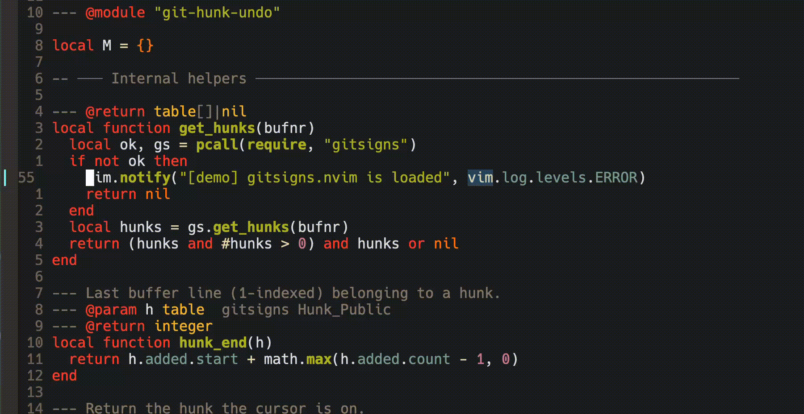

⚠️ Fully vibe coded in 1 prompt but does what I need it to do! 

# git-hunk-undo.nvim

IntelliJ-style per-hunk git rollback for Neovim.

Place your cursor anywhere inside a git-modified hunk and press the revert key.
A floating diff window shows exactly what will be restored — confirm or cancel.

Because the plugin is driven entirely by **git state** (via
[gitsigns.nvim](https://github.com/lewis6991/gitsigns.nvim)) it survives buffer
reloads, session restarts, and reopening files. As long as the hunk exists in
`git diff`, it can be reverted.

---

## Demo



---

## Requirements

- Neovim ≥ 0.9.0
- [gitsigns.nvim](https://github.com/lewis6991/gitsigns.nvim)

---

## Installation

**lazy.nvim**

```lua
{
  "nickyhuyskens/git-hunk-undo.nvim",
  dependencies = { "lewis6991/gitsigns.nvim" },
  config = function()
    require("git-hunk-undo").setup()
  end,
}
```

**packer.nvim**

```lua
use {
  "nickyhuyskens/git-hunk-undo.nvim",
  requires = { "lewis6991/gitsigns.nvim" },
  config = function()
    require("git-hunk-undo").setup()
  end,
}
```

**vim-plug**

```vim
Plug 'lewis6991/gitsigns.nvim'
Plug 'nickyhuyskens/git-hunk-undo.nvim'
```

Then in Lua:
```lua
require("git-hunk-undo").setup()
```

---

## Configuration

Call `setup()` once, anywhere after gitsigns is loaded.

```lua
require("git-hunk-undo").setup({
  -- Each keymap is a string or `false` to disable that individual binding.
  -- Set keymaps = false to disable ALL default keymaps.
  keymaps = {
    undo_hunk    = "<leader>gU",   -- revert hunk under cursor (with confirm)
    preview_hunk = "<leader>gP",   -- peek at the diff (non-focused float)
    next_hunk    = "]H",           -- jump to next hunk
    prev_hunk    = "[H",           -- jump to previous hunk
  },
})
```

### Disable all keymaps (use commands only)

```lua
require("git-hunk-undo").setup({ keymaps = false })
```

### Disable a single keymap

```lua
require("git-hunk-undo").setup({
  keymaps = { preview_hunk = false },
})
```

### Use the Lua API directly (no keymaps at all)

```lua
local ghu = require("git-hunk-undo")
ghu.setup({ keymaps = false })

vim.keymap.set("n", "<leader>ru", ghu.undo_hunk,    { desc = "Revert hunk" })
vim.keymap.set("n", "<leader>rp", ghu.preview_hunk, { desc = "Preview hunk" })
vim.keymap.set("n", "]c",         ghu.next_hunk,    { desc = "Next hunk" })
vim.keymap.set("n", "[c",         ghu.prev_hunk,    { desc = "Prev hunk" })
```

---

## Commands

| Command           | Description                                  |
|-------------------|----------------------------------------------|
| `:GitUndoHunk`    | Revert hunk under cursor (with confirm float)|
| `:GitPreviewHunk` | Non-focused diff preview (auto-closes)       |
| `:GitNextHunk`    | Jump to next hunk                            |
| `:GitPrevHunk`    | Jump to previous hunk                        |

---

## How it works

1. `undo_hunk` calls `gitsigns.get_hunks()` to get buffer-aware hunk data —
   this reflects the *live buffer*, not the file on disk.
2. A confirmation float renders the hunk diff with `filetype=diff` syntax.
3. On confirm, `gitsigns.reset_hunk({start, end})` restores the lines in-buffer
   using the original content from HEAD (or the git index, depending on your
   gitsigns `base` setting).
4. The operation is a pure buffer write — no shell commands, no temp files.

---

## License

MIT — see [LICENSE](LICENSE).
